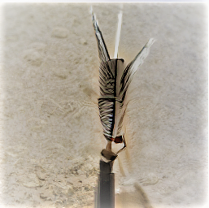

# CrowPenArt  
Reproducible open-sourced generative digital art.   

If you are seeking a TLDR/101 on Gnerative art, just read [this](https://www.artnome.com/news/2018/8/8/why-love-generative-art)

Exhibits:

- Nov 14th - SF- Make Factory https://github.com/vinayprabhu/ArtOfKarlTheFog

- Nov 17th - SF - Artumnal Gathering

